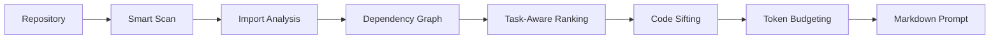

# Codepact

Codepact is a Python CLI that turns a repository into a compact, task-oriented
Markdown prompt for LLMs. It scans the project, builds a local dependency graph,
ranks files against a task, compresses lower-priority code, and fits the final
context inside a token budget.

```bash
codepact build --task "Fix database connection" --limit 8k --output codepact.md
```

## Why Codepact?

LLMs are usually limited less by intelligence than by context quality. Raw
repositories waste the prompt window on repeated boilerplate, unrelated modules,
and implementation details that are not needed for the task.

| Raw repository prompt | Codepact prompt |
| --- | --- |
| Dumps every file equally. | Ranks files by task relevance and dependency distance. |
| Burns tokens on comments, blank lines, generated files, and unrelated code. | Honors `.gitignore`, skips binaries, strips noise, and compresses low-priority files. |
| Makes the model infer project structure from a long blob. | Starts with a Project Map, dependency hints, and priority groups. |
| Fails when the repository is larger than the context window. | Fits output to a configurable token limit with `tiktoken`. |

## How It Works



Codepact keeps high-priority files close to their original source while
compressing everything else into signatures, docstrings, summaries, and graph
metadata.

```text
HIGH    Full code, stripped of comments and blank lines.
MEDIUM  Dependency contracts with signatures and hidden bodies.
LOW     Compressed orientation with signatures/docstrings only.
```

## Installation

Clone the repository and install it in editable mode:

```bash
git clone https://github.com/<you>/codepact.git
cd codepact
python -m venv .venv
source .venv/bin/activate
pip install -e .
```

For development:

```bash
pip install -e ".[dev]"
```

## CLI Usage

Generate a compact prompt for the current repository:

```bash
codepact build \
  --task "Optimize dependency graph" \
  --limit 8k \
  --output codepact.md
```

Use another root directory:

```bash
codepact build \
  --root ~/Projects/api-service \
  --task "Fix database connection pooling" \
  --limit 16k \
  --output api-context.md
```

Exclude tests from scanning:

```bash
codepact build \
  --task "Reduce cold start latency" \
  --exclude-tests \
  --limit 12k
```

Codepact uses Rich for terminal output. A successful run looks like this:

```text
                 Codepact Output
┏━━━━━━━━━━━━━━━┳━━━━━━━━━━━━━━━━━━━━━━━━━━━━━━━━━━━━━━┓
┃ Metric        ┃ Value                                ┃
┡━━━━━━━━━━━━━━━╇━━━━━━━━━━━━━━━━━━━━━━━━━━━━━━━━━━━━━━┩
│ Output        │ /repo/codepact.md                    │
│ Files scanned │ 42                                   │
│ High priority │ 7                                    │
│ Medium        │ 11                                   │
│ Low           │ 24                                   │
│ Tokens        │ 7,812 / 8,000                        │
└───────────────┴──────────────────────────────────────┘
```

## Demo

Generate a self-hosted demo prompt, where Codepact packages its own source code:

```bash
python scripts/demo_output.py
```

The result is written to `demo_result.md`.

## Development

```bash
python -m pytest -q
python -m ruff check src tests scripts
python -m mypy src scripts
```

## Project Layout

```text
src/codepact/
  cli.py        # Typer/Rich command surface
  engine.py     # orchestration
  scanner.py    # .gitignore-aware file scanning
  graph.py      # Python and JS/TS dependency analysis via networkx
  ranker.py     # task-aware graph priority
  sifter.py     # tree-sitter-first code compression
  renderer.py   # structured Markdown output
  tokenizer.py  # tiktoken token counting
  models.py     # shared dataclasses and enums
```

## License

MIT License. See [LICENSE](LICENSE).
