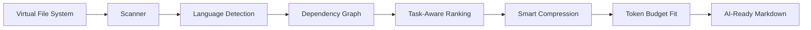

# **Stop Feeding Your LLM Garbage Context. Start Using Codepact.**

**Codepact is a Context-Aware Sifting Engine for real codebases.**

It reads your project, understands the dependency graph, ranks what matters for
your task, and ships only the useful meat to your LLM.

Less junk. Fewer tokens. Better answers.

Built for developers working with 100k+ line codebases who need to talk to
GPT-4o, Claude 3.5 Sonnet, or any serious coding model without dumping the
entire repo into the prompt window.

```bash
codepact build --task "Fix navigation in MainActivity" --limit 8k --output codepact.md
```

## Why Codepact?

Most AI coding workflows waste money before the model even starts thinking.

They copy too much.

They include generated junk.

They bury the important files under boilerplate.

Codepact fixes that.

It can save thousands of dollars in token costs on large teams by sending only
the code that actually matters for the task.

| Without Codepact | With Codepact |
| --- | --- |
| Paste the whole repo and pray. | Send ranked, task-aware context. |
| Burn tokens on tests, locks, assets, and boilerplate. | Drop noise before it hits the model. |
| Make the LLM infer architecture from a giant blob. | Give it a project map, graph hints, and priority groups. |
| Hit context limits fast. | Auto-shrink to fit your token budget. |

## Features

| Feature | What It Means |
| --- | --- |
| 🧠 **Smart Sifting** | Not a file copier. Codepact uses dependency analysis, centrality scoring, task keywords, and smart decay to find the files that define the architecture. |
| 🌍 **Global Native** | UI localization for EN, RU, ZH, JA, and HI. No more language barriers for dev teams. |
| 🎨 **IDE-Grade Experience** | Monaco editor, JetBrains Mono aesthetic, professional dark/light themes, and a fast three-panel workspace. |
| 📊 **Graph Insight** | Visualize the DNA of your project through dependency trees and priority-ranked nodes. |
| ✂️ **Token Discipline** | HIGH files stay code-first. MEDIUM files can become skeletons. LOW files collapse to summaries. The final Markdown is counted against the actual output string. |
| 🧩 **Polyglot Engine** | Tree-Sitter first, regex fallback second. Python, JS, TS, Kotlin, Java, Swift, Go, Rust, C++, C#, PHP, Ruby, Dart, and more. |

## Two-Minute Start

### 1. Backend: FastAPI + Python

```bash
git clone https://github.com/<you>/codepact.git
cd codepact

python -m venv .venv
source .venv/bin/activate

pip install -e ".[dev]"
uvicorn codepact.api:app --reload --host 0.0.0.0 --port 8000
```

Backend runs at:

```text
http://localhost:8000
```

### 2. Frontend: Next.js + TypeScript

```bash
cd webapp
npm install
npm run dev
```

Workspace runs at:

```text
http://localhost:3000
```

If the API lives somewhere else:

```bash
NEXT_PUBLIC_CODEPACT_API_URL=http://localhost:8000 npm run dev
```

## CLI

Generate an AI-ready context file:

```bash
codepact build \
  --task "Explain how MainActivity handles user navigation" \
  --limit 8k \
  --output codepact.md
```

Scan another project:

```bash
codepact build \
  --root ~/Projects/mobile-app \
  --task "Fix chat creation flow" \
  --limit 16k \
  --output mobile-context.md
```

Skip tests when they are not relevant:

```bash
codepact build \
  --task "Reduce cold start latency" \
  --exclude-tests \
  --limit 12k
```

## Web Workspace

Codepact includes a professional IDE-like cockpit:

- File explorer with folder upload.
- Monaco editor for source inspection and edits.
- Sifted Result panel with Preview, Graph, and Raw views.
- Copy-for-AI button that uses the full raw Markdown output.
- Dependency graph visualization.
- Backend connection status.
- Dark and light themes built with CSS variables.
- Localized UI for global teams.

No upload required to try it. The demo project opens instantly.

## Localization Showcase

| Language | Status | Notes |
| --- | --- | --- |
| English | ✅ Ready | Default UI language. |
| Russian | ✅ Ready | Full workspace localization. |
| Chinese | ✅ Ready | Multi-byte layout support. |
| Japanese | ✅ Ready | Multi-byte layout support. |
| Hindi | ✅ Ready | Long-label friendly controls. |

## Under the Hood

Codepact is fast because the architecture is boring in the best way.

| Layer | Tech | Why |
| --- | --- | --- |
| Engine | Python | Great filesystem tooling, AST parsing, and CLI ergonomics. |
| API | FastAPI | Small, async-friendly, fast to run locally or in CI. |
| Graph | networkx | Dependency centrality, distance scoring, and graph traversal. |
| Parser | Tree-Sitter + regex fallback | Deep language coverage without giving up on rare stacks. |
| Tokenizer | tiktoken with fallback | Counts the final Markdown, not just raw files. |
| UI | Next.js Server Components + React | Smooth startup, clean routing, and a responsive app shell. |
| Editor | Monaco | Real code editor behavior, not a textarea pretending to be one. |

The ranking pipeline:



Priority rules are simple:

```text
HIGH    Keep code visible. These files define the answer.
MEDIUM  Keep structure, signatures, docstrings, and useful snippets.
LOW     Keep only orientation when the budget is tight.
DROP    Remove noise completely.
```

## Development

Run backend checks:

```bash
python -m pytest -q
python -m ruff check src tests scripts
python -m mypy src scripts
```

Run frontend checks:

```bash
cd webapp
npm run build
```

If native Next.js SWC fails on your machine:

```bash
npm run dev:wasm
npm run build:wasm
```

## Project Layout

```text
src/codepact/
  api.py        FastAPI backend
  cli.py        Typer/Rich CLI
  engine.py     orchestration and token fitting
  scanner.py    ignore-aware repository scanner
  graph.py      dependency graph analysis
  ranker.py     task-aware importance scoring
  sifter.py     Tree-Sitter and skeleton extraction
  renderer.py   Markdown context rendering
  tokenizer.py  final-output token counting
  language.py   polyglot detection and categorization
  models.py     shared dataclasses and enums

webapp/
  app/          Next.js workspace UI
```

## License

MIT. Build better prompts.
